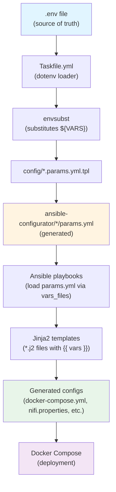

# MODERATE Data Integrity and Validation Architecture Deployment

This repository contains deployment configurations and automation scripts for the MODERATE Data Integrity and Validation Architecture. The deployment includes Apache Kafka for data streaming, Keycloak for identity and access management, Apache NiFi for data processing workflows, and supporting infrastructure components. The deployment is orchestrated using Docker Compose and Ansible, with configuration templates for environment-specific parameters.

> [!NOTE]
> Upstream Git repositories that were previously cloned during deployment are now vendored into this repository (e.g., `ansible-configurator` and NiFi processors) to ensure reproducible deployments. No cloning occurs at deploy time; see "Updating Vendored Repositories" below for how to refresh them.

## Prerequisites

- Docker
- Docker Compose
- Ansible
- Python 3
- OpenSSL
- `keytool`
- `envsubst`
- [Taskfile](https://taskfile.dev)

## Deployment Guide

### Environment Configuration

The `validate-config` task performs essential configuration validation to ensure all required environment variables are properly set before proceeding with deployment. It checks for the presence of the `.env` file, validates SSH key paths, and verifies that mandatory variables like `MACHINE_URL` are configured correctly.

```bash
cp .env.default .env
# Edit .env - update MACHINE_URL, passwords, and environment values
# Set Caddy proxy basic auth: CADDY_BASIC_AUTH_USER and
# CADDY_BASIC_AUTH_PASSWORD (hash computed automatically by the
# start-caddy task for Caddy basic auth on kafka-rest.<MACHINE_URL> and reporter.<MACHINE_URL>)
task validate-config
```

### Initial Setup

All code and Docker images required for deployment are already available (vendored code in this repository, public Docker images from Docker Hub and Quay.io). Optionally verify that required tools are installed:

```bash
task check-dependencies
```

### SSL Certificates

This section handles SSL certificate management for secure communication across services. Caddy automatically obtains and renews Let's Encrypt certificates for the root domain and subdomains defined in `caddy/Caddyfile` (e.g., `keycloak.$MACHINE_URL`, `grafana.$MACHINE_URL`, `reporter.$MACHINE_URL`, `nifi.$MACHINE_URL`, `kafka.$MACHINE_URL`). The certificates must then be copied and converted to Java keystore formats for Kafka, NiFi, and other Java-based services.

#### Initial Certificate Setup

For the initial deployment, run these tasks to set up certificates:

```bash
task copy-caddy-certificates
task setup-letsencrypt-truststore
task convert-letsencrypt-to-java-stores
```

This will:

1. Start Caddy server and obtain Let's Encrypt certificates
2. Copy certificates from Caddy's data directory to expected locations
3. Download Let's Encrypt root certificates and create a Java truststore
4. Convert PEM certificates to Java keystore format (JKS and PKCS12)

#### Certificate Renewal

While Caddy automatically renews Let's Encrypt certificates (typically every 60-90 days), the copied certificates and Java keystores must be updated when renewals occur. The `update-certificates` task runs both `copy-caddy-certificates` and `convert-letsencrypt-to-java-stores`, which are idempotent and will only update if Caddy's certificates are newer:

```bash
task update-certificates
```

### Keycloak Deployment (Run First)

Deploy and configure Keycloak before the rest of the stack so OAuth client credentials are available to other services.

```bash
task start-keycloak
```

Access Keycloak at `https://keycloak.<MACHINE_URL>` (Caddy terminates TLS and reverse-proxies to Keycloak). Log in with `KEYCLOAK_USER` / `KEYCLOAK_PASSWORD` from `.env`, create your realm, and configure OAuth clients for **Kafka**, **NiFi**, and **Grafana**.

| Setting                         | NiFi                          | Kafka                                                            |
| ------------------------------- | ----------------------------- | ---------------------------------------------------------------- |
| Root URL                        | `https://nifi.<MACHINE_URL>`  | `https://kafka.<MACHINE_URL>`                                    |
| Home URL                        | `https://nifi.<MACHINE_URL>`  | `https://kafka.<MACHINE_URL>`                                    |
| Valid redirect URIs             | `https://nifi.<MACHINE_URL>*` | `https://kafka.<MACHINE_URL>*` and `http://kafka.<MACHINE_URL>*` |
| Valid post-logout redirect URIs | `+`                           | `+`                                                              |
| Web origins                     | `+`                           | `+`                                                              |

> [!NOTE]
> Grafana uses pre-configured usernames and passwords and does not seem to integrate with Keycloak for authentication.

Copy the client secrets to `.env`:

- `KAFKA_KEYCLOAK_SECRET`
- `NIFI_KEYCLOAK_SECRET`
- `GRAFANA_KEYCLOAK_SECRET`

> [!IMPORTANT]
> Make sure the client IDs in Keycloak match the values defined in `KAFKA_KEYCLOAK_ID`, `NIFI_KEYCLOAK_ID` and `GRAFANA_KEYCLOAK_ID`.

You can stop Keycloak later with:

```bash
task stop-keycloak
```

### Deploy Infrastructure

The `diva` task orchestrates deployment of Kafka, NiFi, Quality Reporter, and supporting components using Ansible playbooks. It verifies SSL certificates, processes configuration templates, and runs the playbooks. Keycloak is deployed separately and should be configured beforehand (see above).

```bash
task diva
```

## NiFi Processors

Custom NiFi processors are vendored under `ansible-configurator/NiFi_Processors/vendored/` to keep deployments reproducible (no external clones at deploy time). They cover schema normalization, rule generation, data quality checks, and schema-registry validation so that datasets stay consistent as they flow through NiFi and Kafka.

- **Suggested flow:** Encapsulate → Build rules → Validate quality → Validate schema (see below for details and when to enable each step).

### Unified Data Model Encapsulator

- **Purpose:** Wraps incoming payloads into a consistent envelope with metadata fields such as `sourceType`, `sourceID`, `infoType`, `dataType`, `dataItemID`, and `metricTypeID`.
- **Properties:** The six metadata fields (required); set literal values or NiFi Expression Language to read FlowFile attributes.
- **Inputs:** FlowFile content is passed through untouched; attributes optionally used to fill properties.
- **Outputs:** Same content, with metadata injected into the JSON envelope.
- **Configure:** Set each property to an attribute expression (e.g., `${source.id}`) or static string so every record leaves with a full envelope before validation.

### Rule Builder (`RuleBuilderProcessor.py`)

- **Purpose:** Samples CSV/JSON content (auto-detected or forced) to infer lightweight DQA rules (exists, datatype, numeric domain, categorical values, optional regex).
- **Properties:** `Sample Size`, `Max Categories`, `Regex Derivation` (bool), `Dataset ID Attribute`, `Fingerprint Attribute`, `Format` (AUTO/CSV/JSON).
- **Inputs:** FlowFile content (CSV/JSON) and attributes holding dataset id/fingerprint (if present).
- **Outputs:** Attributes `dqa.rules` (YAML), `dqa.version` (fingerprint), dataset id, fingerprint, `dqa.format`; relationships `success` / `failure`.
- **Configure (dataset id):** Defaults to attribute `dataset.id`; if missing, the processor uses `"default-dataset"`. Set this attribute upstream (e.g., UpdateAttribute) so caching and rule grouping are stable.
- **Configure (fingerprint):** Defaults to attribute `dataset.fingerprint`; if missing, the processor computes one from content: JSON → hashes top-level keys (first element for arrays); CSV → hashes header line; otherwise hashes content prefix. Reusing a provided fingerprint keeps cache hits consistent across JVMs.
- **Configure (general):** Leave `Format` as `AUTO` unless you want to force CSV/JSON, tune `Sample Size`/`Max Categories`/`Regex Derivation` to control inferred rules, and send `failure` to DLQ/alerting.

### DQA Validator (`dqa-validator`)

- **Purpose:** Applies YAML-defined validation rules (domain, datatype, categorical, string length, missing, regex) using JMESPath feature paths.
- **Properties:** `Validator ID`, `Validation Rules` (YAML string; typically `${dqa.rules}`).
- **Inputs:** FlowFile content as JSON sample; `Validation Rules` property or attribute.
- **Outputs:** FlowFile content replaced with validation result JSON; relationships `valid` / `invalid` / `failure`.
- **Configure:** Set `Validation Rules` to `${dqa.rules}` (Rule Builder output) or a static YAML; set `Validator ID` for traceability; route `invalid` separately from `failure`.

### Schema Validator (`SchemaValidator.py`)

- **Purpose:** Checks incoming JSON against schemas from a Kafka Schema Registry; can learn new schemas (unless `Strict Check` is true) once seen a minimum number of times.
- **Properties:** `Validator ID`, `Kafka URI`, `Kafka_topic`, optional `Kafka schema ids`, `Minimum Threshold`, `Strict Check`, `Messages History`.
- **Inputs:** FlowFile content JSON with `metricValue` payload; properties may use Expression Language to pull topic/ids from attributes.
- **Outputs:** FlowFile content replaced with validation result JSON; relationships `valid` / `invalid` / `failure`; may register schemas when allowed.
- **Configure:** Set `Kafka URI` to the registry endpoint (e.g., `http://kafka.${MACHINE_URL}:8081`), pre-seed known schemas via `Kafka schema ids`, enable `Strict Check=true` to block unknown schemas, and tune `Minimum Threshold`/`Messages History` to balance learning speed vs noise.

## Configuration Templating System

This deployment uses Ansible with Jinja2 templates to generate environment-specific configuration files. Templates contain placeholders that are substituted with actual values during deployment, ensuring consistent and reproducible configurations across all services.

### Configuration Flow: From .env to Deployment

The `.env.default` and `.env` files serve as the **single source of truth** for all configuration values. These environment variables flow through the system in the following sequence:

1. **Environment Variables** (`.env` file)

   - Copy `.env.default` to `.env` and customize values for your environment
   - Contains all passwords, URLs, client IDs, and deployment-specific settings
   - Variables include `MACHINE_URL`, `GENERIC_PSW`, `KAFKA_USER`, `NIFI_KEYCLOAK_SECRET`, etc.

2. **Taskfile Reads Environment** (Taskfile.yml)

   - Taskfile automatically loads `.env` and `.env.default` using the `dotenv` directive
   - All Task commands have access to these environment variables
   - Tasks like `process-configuration-templates` use these variables

3. **Generate Ansible Parameters** (Taskfile.yml)

   - The `process-configuration-templates` task uses `envsubst` to substitute `${VARIABLE}` placeholders
   - Reads template files from `config/*.params.yml.tpl`
   - Generates `params.yml` files for each component in `ansible-configurator/`
   - Example: `${MACHINE_URL}` in template becomes `example.tailscale.net` in generated file

4. **Ansible Loads Parameters** (ansible-configurator/\*/ansible-plb.yml)

   - Each Ansible playbook loads its `params.yml` using `vars_files`
   - Variables become available as `{{ general_vars.machine_url }}`, `{{ kafka_cred.kafka_user }}`, etc.

5. **Template Substitution** (Ansible `template` module)
   - Ansible processes Jinja2 templates (`.j2` files) with loaded variables
   - Generates final configuration files (Docker Compose, properties files, etc.)
   - Docker Compose uses these generated files to start containers

**Visual Flow:**



### Template Structure

Configuration templates are organized by component:

```
moderate-diva-deployment/
├── kafka/templates/
│   ├── docker-compose.yml.j2      # Kafka Docker Compose configuration
│   ├── client.config.j2           # Kafka client configuration
│   └── kafka-ui-config.yml.j2     # Kafka UI configuration
├── nifi/templates/
│   ├── docker-compose.yml.j2      # NiFi Docker Compose configuration
│   └── nifi.properties.j2         # NiFi properties file
└── quality_reporter/templates/
    └── docker-compose.yml.j2      # Quality Reporter Docker Compose configuration
```

### How Ansible Processes Templates

During deployment, Ansible playbooks use the `ansible.builtin.template` module to process Jinja2 templates:

1. **Load Variables**: Ansible reads configuration from `params.yml` files (generated from `.env` values)
2. **Process Templates**: The template module reads `.j2` files and substitutes all `{{ variable_name }}` placeholders
3. **Generate Configs**: Processed files are written to component directories (without `.j2` extension)
4. **Deploy Services**: Docker Compose uses the generated configuration files to start containers

### Variable Sources

Variables are organized hierarchically in `params.yml` files:

- **General Variables** (`ansible-configurator/params.yml`): Shared across all components (machine URL, project name, Keycloak URL, passwords)
- **Component Variables** (`ansible-configurator/{Kafka,NiFi,Quality_Reporter}/params.yml`): Component-specific settings (usernames, client IDs, secrets)

These `params.yml` files are generated from your `.env` file during deployment and are not version-controlled (only the `.tpl` templates are tracked in Git).
